# PrismWeave AI Processing Architecture: Complete System Overview

*A comprehensive guide to understanding the AI processing pipeline, its components, and how they work together*

## 🎯 Executive Summary

The PrismWeave AI Processing system is a sophisticated, privacy-focused document intelligence pipeline that transforms captured markdown documents into a searchable, semantic knowledge base. Built around local Ollama AI models, it provides document analysis, automatic categorization, summarization, and vector-based semantic search without sending data to external services.

## 🏗️ System Architecture Overview

```mermaid
graph TB
    Input[📄 Markdown Documents] --> Config[⚙️ Configuration Manager]
    Config --> Ollama[🤖 Ollama Client]
    
    Ollama --> DocProc[📊 Document Processor]
    DocProc --> Analysis[🔍 Content Analysis]
    DocProc --> Summary[📝 Summarization]
    DocProc --> Tags[🏷️ Tag Generation]
    DocProc --> Category[📁 Categorization]
    
    Analysis --> VectorDB[(🗄️ Vector Database)]
    Summary --> VectorDB
    Tags --> VectorDB
    Category --> VectorDB
    
    VectorDB --> Search[🔍 Semantic Search]
    Search --> Results[📋 Search Results]
    
    CLI[💻 CLI Interface] --> DocProc
    CLI --> Search
    CLI --> Status[📊 Health Check]
```



## 📁 Project Structure Deep Dive

```
ai-processing/
├── 📄 config.yaml              # Central configuration file
├── 📄 pyproject.toml           # Modern Python project definition
├── 📄 setup.py                 # Automated setup script
├── 📄 requirements.txt         # Python dependencies
├── 📄 uv.lock                  # UV lock file for reproducible builds
│
├── 📁 src/                     # Core processing engine
│   ├── 📁 models/              # AI model integrations
│   │   ├── 📄 __init__.py
│   │   └── 📄 ollama_client.py # Ollama API wrapper
│   │
│   ├── 📁 processors/          # Document analysis engines
│   │   ├── 📄 __init__.py
│   │   └── 📄 document_processor.py # Main processing logic
│   │
│   ├── 📁 search/              # Semantic search components
│   │   ├── 📄 __init__.py
│   │   └── 📄 semantic_search.py # Vector search engine
│   │
│   └── 📁 utils/               # Configuration and utilities
│       ├── 📄 __init__.py
│       └── 📄 config.py        # Configuration management
│
├── 📁 cli/                     # Command-line interface
│   └── 📄 prismweave.py        # Main CLI application
│
├── 📁 tests/                   # Test suite
│   ├── 📄 test_ollama_client.py
│   ├── 📄 test_document_processor.py
│   └── 📄 test_semantic_search.py
│
├── 📁 logs/                    # Processing logs
├── 📁 .prismweave/            # Data storage directory
│   ├── 📁 chroma_db/          # Vector database files
│   ├── 📁 summaries/          # Generated summaries
│   └── 📁 metadata/           # Enhanced metadata
│
└── 📁 dev-tools/              # Development utilities
    ├── 📄 debug_ollama.py     # Ollama connection testing
    ├── 📄 debug_models.py     # Model diagnostics
    └── 📄 validate.py         # System validation
```

## 🧠 Core Components Explained

### 1. Configuration Management (`src/utils/config.py`)

**Purpose**: Centralized configuration system that manages all settings for the AI processing pipeline.

**Key Classes**:
- `Config`: Main configuration class with hierarchical settings
- `OllamaConfig`: Ollama server and model configurations  
- `ProcessingConfig`: Document processing parameters
- `VectorDBConfig`: Vector database settings
- `SearchConfig`: Search behavior configuration

**Key Features**:
```python
# Example configuration usage
config = get_config()
ollama_host = config.ollama.host
batch_size = config.processing.batch_size
embedding_model = config.get_model_config('embedding')['primary']
```

**Configuration Hierarchy**:
```yaml
ollama:                    # AI model server settings
  host: http://localhost:11434
  models:
    large: {primary: "llama3.1:8b", fallback: "mistral:7b"}
    small: {primary: "phi3:mini", fallback: "qwen2:1.5b"}
    embedding: {primary: "nomic-embed-text"}

processing:                # Document processing settings
  batch_size: 5
  chunk_size: 1000
  quality_thresholds: {high: 8.0, medium: 5.0, low: 2.0}

vector_db:                 # Vector database configuration
  type: "chroma"
  chroma: {persist_directory: "../.prismweave/chroma_db"}

search:                    # Search behavior settings
  semantic_weight: 0.7
  keyword_weight: 0.3
```

### 2. Ollama Client (`src/models/ollama_client.py`)

**Purpose**: Robust wrapper around the Ollama API that provides type-safe, async communication with local AI models.

**Key Classes**:
- `OllamaClient`: Main client for model communication
- `ModelInfo`: Information about available models
- `GenerationResult`: Type-safe response from text generation

**Key Features**:

**Model Management**:
```python
async with OllamaClient() as client:
    # Check availability
    is_available = await client.is_available()
    
    # List models
    models = await client.list_models()
    
    # Pull new models
    success = await client.pull_model("phi3:mini")
    
    # Check model existence
    exists = await client.model_exists("nomic-embed-text")
```

**Text Generation**:
```python
# Single response generation
result = await client.generate(
    model="phi3:mini",
    prompt="Analyze this document...",
    system="You are a document analysis expert"
)

# Streaming generation
async for chunk in client.generate(model="phi3:mini", prompt="...", stream=True):
    print(chunk, end="")
```

**Embedding Generation**:
```python
# Generate embeddings for search
embeddings = await client.embed(
    model="nomic-embed-text",
    input_text=["Document chunk 1", "Document chunk 2"]
)
```

**Error Handling & Robustness**:
- Automatic fallback between async and sync clients
- Graceful handling of model availability
- Comprehensive error logging and debugging
- Support for both HTTP and direct Ollama communication

### 3. Document Processor (`src/processors/document_processor.py`)

**Purpose**: The heart of the AI analysis pipeline that processes markdown documents and extracts intelligence using AI models.

**Key Classes**:
- `DocumentProcessor`: Main processing engine
- `DocumentMetadata`: Structured document metadata
- `ProcessingResult`: Results of document analysis

**Processing Pipeline**:

```python
# Document processing workflow
async with DocumentProcessor() as processor:
    result = await processor.process_document(file_path)
```

**Stage 1: Content Extraction**
```python
def _extract_content_from_markdown(self, file_path: Path) -> Tuple[DocumentMetadata, str]:
    # Parse frontmatter using python-frontmatter
    # Extract YAML metadata (title, url, tags, etc.)
    # Return clean content and structured metadata
```

**Stage 2: Content Analysis**
```python
def _analyze_content_structure(self, content: str) -> Dict[str, Any]:
    # Word count and reading time estimation
    # Markdown element counting (headers, code blocks, links, images)
    # Technical content detection
    # Complexity scoring using textstat
    # Language detection using langdetect
```

**Stage 3: AI-Powered Analysis**
```python
# Parallel execution of AI tasks
tasks = [
    self._generate_summary(content, title),
    self._suggest_tags(content, title, existing_tags),
    self._categorize_document(content, title, tags)
]
results = await asyncio.gather(*tasks)
```

**AI Analysis Tasks**:

1. **Summarization**:
   - Uses small models (phi3:mini) for speed
   - Generates 2-3 sentence concise summaries
   - Focuses on key insights and actionable information

2. **Tag Generation**:
   - Analyzes content for relevant technologies and concepts
   - Combines with predefined taxonomy from configuration
   - Suggests 3-7 relevant tags per document

3. **Categorization**:
   - Classifies documents into predefined categories
   - Categories: tech, research, business, tutorial, reference, news, opinion
   - Uses content analysis and existing tags for classification

4. **Quality Scoring**:
   - 0-10 scale based on multiple factors
   - Content length, structure, metadata completeness
   - Technical depth and readability

**Output Structure**:
```python
ProcessingResult(
    success=True,
    document_path="path/to/document.md",
    metadata=DocumentMetadata(...),
    generated_summary="AI-generated summary...",
    suggested_tags=["tag1", "tag2", "tag3"],
    suggested_category="tech",
    quality_score=8.5,
    processing_time=2.3
)
```

### 4. Semantic Search Engine (`src/search/semantic_search.py`)

**Purpose**: Advanced search system that uses vector embeddings and semantic similarity to find relevant documents based on meaning rather than just keywords.

**Key Classes**:
- `SemanticSearch`: Main search engine
- `SearchResult`: Individual search result with scoring
- `SearchResponse`: Complete search response with metadata

**Search Architecture**:

**Vector Database Integration**:
```python
# ChromaDB for persistent vector storage
self.chroma_client = chromadb.PersistentClient(path=persist_dir)
self.collection = self.chroma_client.get_or_create_collection(
    name="prismweave_documents"
)

# Document indexing
embeddings = await self.ollama_client.embed(model="nomic-embed-text", input_text=chunks)
self.collection.add(embeddings=embeddings, documents=chunks, metadatas=metadata)
```

**Search Types**:

1. **Semantic Search**:
   ```python
   # Convert query to embedding
   query_embedding = await self.ollama_client.embed(model="nomic-embed-text", input_text=[query])
   
   # Find similar vectors
   results = self.collection.query(
       query_embeddings=[query_embedding],
       n_results=max_results,
       include=['documents', 'metadatas', 'distances']
   )
   ```

2. **Hybrid Search**:
   ```python
   # Combine semantic and keyword results
   semantic_results = await self._semantic_search(query, max_results * 2)
   keyword_results = await self._keyword_search(query, max_results)
   
   # Weighted combination
   final_score = semantic_score * 0.7 + keyword_score * 0.3
   ```

3. **Document Similarity**:
   ```python
   # Find documents similar to a given document
   similar_docs = await search_engine.find_similar_documents(
       document_path="path/to/reference.md",
       max_results=5
   )
   ```

**Indexing Process**:
1. **Text Chunking**: Split documents into optimal chunks for embedding
2. **Embedding Generation**: Create vector representations using nomic-embed-text
3. **Metadata Storage**: Store document metadata with vectors
4. **Vector Storage**: Persist in ChromaDB for fast retrieval

**Search Results**:
```python
SearchResult(
    document_path="documents/tech/typescript-patterns.md",
    title="Advanced TypeScript Patterns",
    similarity_score=0.87,
    snippet="TypeScript provides powerful type system features...",
    metadata={"category": "tech", "tags": ["typescript", "patterns"]},
    rank=1
)
```

### 5. CLI Interface (`cli/prismweave.py`)

**Purpose**: User-friendly command-line interface that provides access to all AI processing capabilities with rich formatting and progress indicators.

**Main Commands**:

**Document Processing**:
```bash
# Process all documents in the default directory
python cli/prismweave.py process

# Process specific directory
python cli/prismweave.py process /path/to/documents

# Process single file
python cli/prismweave.py process document.md --single-file

# Output formats
python cli/prismweave.py process --format json
python cli/prismweave.py process --format table
```

**Semantic Search**:
```bash
# Basic search
python cli/prismweave.py search "machine learning concepts"

# Advanced search options
python cli/prismweave.py search "typescript patterns" --max-results 10 --type hybrid
```

**System Status**:
```bash
# Complete system health check
python cli/prismweave.py status

# Configuration display
python cli/prismweave.py config
python cli/prismweave.py config --reload
```

**Rich CLI Features**:
- **Progress Bars**: Real-time processing progress with Rich library
- **Colored Output**: Status indicators and formatted tables
- **Error Handling**: Graceful error messages with troubleshooting hints
- **Health Checks**: Comprehensive system diagnostics

```python
# Example CLI output formatting
if console and Table:
    table = Table(title="Document Processing Results")
    table.add_column("Document", style="cyan")
    table.add_column("Category", style="magenta")
    table.add_column("Quality", style="green")
    table.add_column("Tags", style="blue")
    table.add_column("Status", style="yellow")
    
    for result in results:
        table.add_row(doc_name, category, quality, tags, status)
    
    console.print(table)
```

## 🔄 Data Flow and Processing Pipeline

### End-to-End Document Processing Flow


### Search Query Flow


## ⚙️ Configuration Deep Dive

### Multi-Model Strategy

The system uses different AI models optimized for specific tasks:

```yaml
ollama:
  models:
    # Large models (7B-13B parameters) for complex analysis
    large:
      primary: "llama3.1:8b"           # High-quality reasoning
      fallback: "mistral:7b"           # Alternative large model
      use_cases: ["summarization", "content_analysis", "relationship_detection"]
    
    # Small models (1B-3B parameters) for fast operations
    small:
      primary: "phi3:mini"             # Fast general-purpose
      fallback: "qwen2:1.5b"           # Alternative small model
      use_cases: ["tagging", "classification", "quick_analysis"]
    
    # Specialized embedding models for vector search
    embedding:
      primary: "nomic-embed-text"      # High-quality embeddings
      fallback: "mxbai-embed-large"    # Alternative embedding model
      dimensions: 768                   # Vector dimensions
    
    # Code-specific models for technical content
    code:
      primary: "codellama:7b"          # Code understanding
      fallback: "deepseek-coder:6.7b"  # Alternative code model
      use_cases: ["code_analysis", "technical_content"]
```

### Processing Configuration

```yaml
processing:
  # Batch processing for efficiency
  batch_size: 5                    # Documents processed simultaneously
  max_concurrent: 2                # Maximum concurrent AI requests
  retry_attempts: 3                # Retry failed operations
  retry_delay: 1.0                 # Delay between retries (seconds)
  
  # Content handling
  min_content_length: 100          # Minimum content length to process
  max_content_length: 50000        # Maximum content length (truncate if longer)
  chunk_size: 1000                 # Text chunk size for embeddings
  chunk_overlap: 200               # Overlap between chunks
  
  # Quality scoring thresholds
  quality_thresholds:
    high: 8.0                      # High-quality content threshold
    medium: 5.0                    # Medium-quality content threshold
    low: 2.0                       # Low-quality content threshold
```

### Vector Database Configuration

```yaml
vector_db:
  type: "chroma"                   # Database type (chroma or sqlite)
  
  # ChromaDB settings (recommended)
  chroma:
    persist_directory: "../.prismweave/chroma_db"
    collection_name: "prismweave_documents"
    
  # SQLite settings (alternative)
  sqlite:
    path: "../.prismweave/vectors.db"
    table_name: "document_embeddings"
  
  # Search settings
  search:
    max_results: 20                # Maximum search results
    similarity_threshold: 0.7       # Minimum similarity score
    rerank_results: true           # Re-rank results by relevance
```

## 📊 Performance Characteristics

### Processing Performance

**Benchmarks** (AI HX 370 NPU):
- **Document Processing**: 50-100 documents per minute
- **Summary Generation**: 2-5 seconds per document
- **Tag Suggestion**: 1-3 seconds per document
- **Embedding Generation**: 1-2 seconds per document
- **Search Queries**: 100-500ms response time

**Memory Usage**:
- **Base System**: ~1GB RAM
- **Per Document**: ~10-50MB during processing
- **Vector Database**: ~1MB per 1000 documents
- **Model Loading**: 2-8GB depending on model size

**Storage Requirements**:
- **ChromaDB**: ~1MB per 100 processed documents
- **Embeddings**: ~3KB per document chunk
- **Metadata**: ~1KB per document
- **Logs**: ~10MB per 1000 processed documents

### Optimization Strategies

**Model Selection**:
```python
# Use appropriate model size for task
small_tasks = ["tagging", "classification", "simple_analysis"]
large_tasks = ["summarization", "complex_analysis", "reasoning"]

if task in small_tasks:
    model = config.get_model_config('small')['primary']  # phi3:mini
else:
    model = config.get_model_config('large')['primary']  # llama3.1:8b
```

**Batch Processing**:
```python
# Process documents in batches for efficiency
batch_size = config.processing.batch_size  # Default: 5
for i in range(0, len(documents), batch_size):
    batch = documents[i:i + batch_size]
    tasks = [process_document(doc) for doc in batch]
    results = await asyncio.gather(*tasks)
```

**Caching Strategy**:
```python
# Cache expensive operations
@lru_cache(maxsize=128)
def get_embeddings(text_hash: str) -> List[float]:
    # Cache embeddings to avoid regeneration
    pass

# Skip reprocessing if document unchanged
if doc_hash == stored_hash and not force_reprocess:
    return cached_result
```

## 🔍 Search Capabilities Deep Dive

### Vector Search Architecture

**Embedding Generation**:
```python
# Document indexing process
async def index_document(self, file_path: Path, content: str, metadata: Dict[str, Any]) -> bool:
    # 1. Split content into chunks
    chunks = self._extract_text_chunks(content, chunk_size=1000, overlap=200)
    
    # 2. Generate embeddings for each chunk
    embeddings = await self.ollama_client.embed(
        model="nomic-embed-text",
        input_text=chunks
    )
    
    # 3. Store in vector database with metadata
    self.collection.add(
        embeddings=embeddings,
        documents=chunks,
        metadatas=[{...metadata, "chunk_index": i} for i in range(len(chunks))],
        ids=[f"{doc_id}_{i}" for i in range(len(chunks))]
    )
```

**Query Processing**:
```python
# Search query processing
async def search(self, query: str, max_results: int = 20) -> SearchResponse:
    # 1. Convert query to embedding
    query_embedding = await self.ollama_client.embed(
        model="nomic-embed-text",
        input_text=[query]
    )
    
    # 2. Find similar vectors
    results = self.collection.query(
        query_embeddings=[query_embedding],
        n_results=max_results,
        include=['documents', 'metadatas', 'distances']
    )
    
    # 3. Convert distances to similarity scores
    similarity_scores = [1 - distance for distance in results['distances'][0]]
    
    # 4. Format and rank results
    search_results = [
        SearchResult(
            document_path=metadata['document_path'],
            title=metadata.get('title', 'Untitled'),
            similarity_score=similarity,
            snippet=self._generate_snippet(document, query),
            metadata=metadata,
            rank=i + 1
        )
        for i, (document, metadata, similarity) in enumerate(
            zip(results['documents'][0], results['metadatas'][0], similarity_scores)
        )
        if similarity >= similarity_threshold
    ]
    
    return SearchResponse(query=query, results=search_results, ...)
```

### Search Result Ranking

**Multi-Factor Ranking**:
```python
def _calculate_relevance_score(self, result: SearchResult, query: str) -> float:
    base_score = result.similarity_score
    
    # Boost for title matches
    if query.lower() in result.title.lower():
        base_score *= 1.2
    
    # Boost for high-quality documents
    quality_score = result.metadata.get('quality_score', 5.0)
    quality_multiplier = 1.0 + (quality_score - 5.0) / 10.0
    base_score *= quality_multiplier
    
    # Boost for recent documents
    recency_multiplier = self._calculate_recency_boost(result.metadata.get('captured_date'))
    base_score *= recency_multiplier
    
    return base_score
```

**Snippet Generation**:
```python
def _generate_snippet(self, document: str, query: str, max_length: int = 200) -> str:
    # Find best matching sentence
    sentences = document.split('.')
    query_words = set(query.lower().split())
    
    best_sentence = ""
    best_score = 0
    
    for sentence in sentences:
        sentence_words = set(sentence.lower().split())
        overlap = len(query_words.intersection(sentence_words))
        
        if overlap > best_score:
            best_score = overlap
            best_sentence = sentence
    
    # Truncate and add context
    if len(best_sentence) > max_length:
        best_sentence = best_sentence[:max_length] + "..."
    
    return best_sentence.strip()
```

## 🚀 Development and Extension Guide

### Adding Custom Processors

```python
from src.processors.document_processor import DocumentProcessor, ProcessingResult
from pathlib import Path

class CustomAnalysisProcessor(DocumentProcessor):
    """Custom processor for specialized document analysis"""
    
    async def process_document(self, file_path: Path) -> ProcessingResult:
        # Call parent processor first
        base_result = await super().process_document(file_path)
        
        if not base_result.success:
            return base_result
        
        # Add custom analysis
        custom_analysis = await self._custom_analysis(base_result.metadata.content)
        
        # Enhance result with custom data
        base_result.metadata.custom_field = custom_analysis
        return base_result
    
    async def _custom_analysis(self, content: str) -> Dict[str, Any]:
        # Your custom analysis logic
        return {"analysis_type": "custom", "insights": [...]}
```

### Creating Custom Search Filters

```python
from src.search.semantic_search import SemanticSearch, SearchResult

class EnhancedSearch(SemanticSearch):
    """Enhanced search with custom filtering"""
    
    async def search_by_category(
        self,
        query: str,
        category: str,
        max_results: int = 20
    ) -> List[SearchResult]:
        # Get base search results
        response = await self.search(query, max_results * 2)
        
        # Filter by category
        filtered_results = [
            result for result in response.results
            if result.metadata.get('category') == category
        ]
        
        return filtered_results[:max_results]
    
    async def search_by_tags(
        self,
        query: str,
        required_tags: List[str],
        max_results: int = 20
    ) -> List[SearchResult]:
        # Get base search results
        response = await self.search(query, max_results * 2)
        
        # Filter by required tags
        filtered_results = []
        for result in response.results:
            result_tags = set(result.metadata.get('tags', []))
            if set(required_tags).issubset(result_tags):
                filtered_results.append(result)
        
        return filtered_results[:max_results]
```

### Adding New AI Models

```python
# In config.yaml, add new model configuration
ollama:
  models:
    # Add custom model type
    custom_analysis:
      primary: "custom-model:7b"
      fallback: "phi3:mini"
      use_cases: ["specialized_analysis"]

# In code, use the new model
model_config = self.config.get_model_config('custom_analysis')
model_name = model_config['primary']

result = await self.ollama_client.generate(
    model=model_name,
    prompt="Perform specialized analysis...",
    system="You are a specialized analysis expert..."
)
```

## 🔧 Troubleshooting and Maintenance

### Common Issues and Solutions

**1. Ollama Connection Issues**
```bash
# Problem: Cannot connect to Ollama server
Error: Failed to connect to Ollama at http://localhost:11434

# Solutions:
# Check if Ollama is running
ollama serve

# Verify configuration
python cli/prismweave.py config show

# Test connection directly
python -c "
import asyncio
from src.models.ollama_client import OllamaClient

async def test():
    async with OllamaClient() as client:
        available = await client.is_available()
        print(f'Ollama available: {available}')

asyncio.run(test())
"
```

**2. Model Loading Errors**
```bash
# Problem: Model not found or fails to load
Error: Model 'phi3:mini' not found

# Solutions:
# List available models
ollama list

# Pull missing models
ollama pull phi3:mini
ollama pull nomic-embed-text

# Check model status in PrismWeave
python cli/prismweave.py status
```

**3. Memory and Performance Issues**
```python
# Problem: Out of memory during processing
# Solution: Adjust configuration in config.yaml

processing:
  batch_size: 2          # Reduce from default 5
  max_concurrent: 1      # Reduce from default 2
  chunk_size: 500        # Reduce from default 1000

# Or process documents individually
python cli/prismweave.py process --single-file document.md
```

**4. Search Index Issues**
```bash
# Problem: Search returns no results
# Solution: Rebuild search index

# Delete existing index
rm -rf .prismweave/chroma_db/

# Reprocess all documents
python cli/prismweave.py process --force-reprocess
```

### System Health Monitoring

```python
# Comprehensive health check
async def detailed_health_check():
    from src.processors.document_processor import DocumentProcessor
    from src.search.semantic_search import SemanticSearch
    
    async with DocumentProcessor() as processor:
        proc_health = await processor.health_check()
        print(f"Processor Health: {proc_health}")
    
    async with SemanticSearch() as search:
        search_health = await search.health_check()
        print(f"Search Health: {search_health}")

# Run health check
asyncio.run(detailed_health_check())
```

### Performance Monitoring

```python
# Monitor processing performance
import time
import psutil
from pathlib import Path

def monitor_processing():
    start_time = time.time()
    start_memory = psutil.Process().memory_info().rss / 1024 / 1024  # MB
    
    # Run processing
    results = await processor.process_batch(document_paths)
    
    end_time = time.time()
    end_memory = psutil.Process().memory_info().rss / 1024 / 1024  # MB
    
    print(f"Processing time: {end_time - start_time:.2f}s")
    print(f"Memory usage: {end_memory - start_memory:.2f}MB")
    print(f"Documents processed: {len(results)}")
    print(f"Average time per document: {(end_time - start_time) / len(results):.2f}s")
```

## 🎯 Use Cases and Examples

### 1. Research Knowledge Base

```bash
# Process research papers and articles
python cli/prismweave.py process /path/to/research-papers/

# Search for specific concepts
python cli/prismweave.py search "machine learning interpretability methods"
python cli/prismweave.py search "neural network architectures transformers"

# Find related papers
python cli/prismweave.py similar "papers/attention-is-all-you-need.md"
```

### 2. Technical Documentation

```bash
# Process technical documentation
python cli/prismweave.py process /path/to/tech-docs/ --category tech

# Search for implementation details
python cli/prismweave.py search "API authentication patterns"
python cli/prismweave.py search "database migration strategies"

# Filter by technology
python cli/prismweave.py search "caching" --tags "redis,performance"
```

### 3. Content Curation

```bash
# Process news articles and blog posts
python cli/prismweave.py process /path/to/articles/ --batch-size 10

# Find content by topic
python cli/prismweave.py search "artificial intelligence trends 2024"
python cli/prismweave.py search "web development best practices"

# Generate topic summaries
python cli/prismweave.py summarize --topic "javascript frameworks"
```

## 🌟 Future Roadmap and Extensions

### Planned Enhancements

**1. Advanced AI Analysis**
- Multi-modal processing (text + images)
- Relationship extraction between documents
- Automatic knowledge graph generation
- Sentiment analysis and tone detection

**2. Enhanced Search Capabilities**
- Temporal search (find documents by time period)
- Multi-hop reasoning (connect related concepts)
- Question-answering over document collection
- Automatic query expansion and refinement

**3. Integration Features**
- VS Code extension integration
- Web API for external access
- Real-time document monitoring
- Export to various formats

**4. Performance Optimizations**
- Incremental indexing for large collections
- Distributed processing for massive datasets
- Advanced caching strategies
- GPU acceleration support

### Extension Points

**Custom Analyzers**:
```python
class DomainSpecificAnalyzer:
    """Analyzer specialized for specific domains (legal, medical, etc.)"""
    async def analyze_legal_document(self, content: str) -> Dict[str, Any]:
        # Domain-specific analysis logic
        pass
```

**Custom Search Strategies**:
```python
class GraphBasedSearch:
    """Search using document relationship graphs"""
    async def search_by_relationships(self, query: str) -> List[SearchResult]:
        # Graph-based search logic
        pass
```

**Custom Output Formats**:
```python
class CustomExporter:
    """Export processed documents in custom formats"""
    def export_to_obsidian(self, documents: List[Document]) -> str:
        # Generate Obsidian-compatible output
        pass
```

## 📚 Conclusion

The PrismWeave AI Processing system represents a sophisticated, privacy-focused approach to document intelligence. By leveraging local AI models through Ollama, it provides powerful semantic search, automated analysis, and intelligent organization without compromising data privacy.

**Key Strengths**:
- **Privacy-First**: All processing happens locally using Ollama
- **Modular Architecture**: Easy to extend and customize
- **Performance Optimized**: Multi-model strategy for optimal speed/quality balance
- **Rich CLI**: User-friendly interface with comprehensive functionality
- **Robust Configuration**: Flexible settings for various use cases

**Primary Use Cases**:
- Research knowledge bases with semantic search
- Technical documentation with intelligent categorization
- Content curation with AI-powered insights
- Personal knowledge management with advanced querying

The system is designed to scale from personal document collections to enterprise knowledge bases, providing the foundation for intelligent document management in the modern information age.

---

*For questions, issues, or contributions, please refer to the project documentation and troubleshooting guides.*
