# PrismWeave RAG System

**Retrieval Augmented Generation for Intelligent Document Synthesis**

Transform your document collection into an intelligent knowledge base that can answer questions, synthesize insights, and provide contextual information using local AI models.

## 🎯 What is RAG?

**Retrieval Augmented Generation (RAG)** combines the power of semantic search with AI language models to provide accurate, contextual answers based on your specific document collection. Instead of relying on the AI model's training data alone, RAG:

1. **Retrieves** relevant documents from your knowledge base
2. **Augments** the AI prompt with this specific context  
3. **Generates** accurate answers based on your actual documents

## 🏗️ Architecture Overview

```mermaid
graph TB
    Query[❓ User Question] --> Embed[🔢 Convert to Embeddings]
    Embed --> Search[🔍 Vector Search]
    Search --> Docs[📚 Relevant Documents]
    Docs --> Context[📋 Build Context]
    Context --> LLM[🤖 Language Model]
    LLM --> Answer[💡 Generated Answer]
    
    VectorDB[(🗄️ ChromaDB)] --> Search
    DocumentRepo[📁 PrismWeaveDocs] --> VectorDB
```



## 🚀 Quick Start

### 1. Setup the RAG System

```bash
# Navigate to the AI processing directory
cd ai-processing

# Run the CLI with setup
python cli/prismweave.py --setup
```

This will:
- ✅ Check system requirements
- 📥 Download required AI models
- 🗄️ Initialize vector database  
- 📝 Process sample documents
- 🧠 Test the RAG system

### 2. Start Asking Questions

```bash
# Ask any question about your documents
python cli/prismweave.py ask "What are the main topics covered in the research papers?"

# Get technical help
python cli/prismweave.py tech "How do I implement authentication in TypeScript?" --technologies "typescript,auth"

# Synthesize research
python cli/prismweave.py research "machine learning interpretability"
```

## 💡 RAG System Features

### 🎯 **Multiple Query Types**

| Command | Purpose | Example |
|---------|---------|---------|
| `ask` | General questions | `ask "What is RAG?"` |
| `tech` | Technical queries | `tech "How to optimize Python performance?"` |
| `research` | Research synthesis | `research "neural networks"` |

### 📊 **Response Styles**

| Style | Use Case | Output |
|-------|----------|--------|
| `brief` | Quick answers | 2-3 sentences |
| `comprehensive` | Detailed analysis | Full explanations with examples |
| `technical` | Implementation details | Code examples, APIs, configurations |

### 🎛️ **Advanced Filtering**

```bash
# Filter by document category
python cli/prismweave.py ask "Show me tutorials" --category tutorial

# Filter by tags
python cli/prismweave.py ask "Python best practices" --tags "python,performance"

# Limit context documents
python cli/prismweave.py ask "What is AI?" --max-docs 5

# Get JSON output
python cli/prismweave.py ask "Explain vector databases" --format json
```

## 📁 Storage Strategy

Your embeddings are stored in **PrismWeaveDocs** for optimal data locality:

```
PrismWeaveDocs/
├── .prismweave/
│   ├── chroma_db/              # 🗄️ Vector embeddings (ChromaDB)
│   ├── summaries/              # 📝 AI-generated summaries  
│   ├── metadata/               # 📊 Enhanced document metadata
│   ├── knowledge_graph.json    # 🕸️ Document relationships
│   └── setup_report.json       # 📋 System status
├── documents/                  # 📚 Your markdown files
└── images/                     # 🖼️ Referenced images
```

**Why this approach?**
- ✅ **Data Locality**: Embeddings stay with documents
- ✅ **Sync Benefits**: Everything travels together
- ✅ **Backup Simplicity**: One repository to manage
- ✅ **Version Control**: Git tracks when regeneration needed

## 🔧 Configuration

The RAG system uses the same `config.yaml` as the main AI processing:

```yaml
# Key RAG-related settings
vector_db:
  type: "chroma"
  chroma:
    persist_directory: "../PrismWeaveDocs/.prismweave/chroma_db"

ollama:
  models:
    large:
      primary: "llama3.1:8b"      # For synthesis
    embedding:
      primary: "nomic-embed-text"  # For vector search

processing:
  chunk_size: 1000               # Text chunk size
  chunk_overlap: 200             # Overlap between chunks
```

## 🎭 Usage Examples

### Basic Question Answering
```bash
# Simple question
python cli/prismweave.py ask "What is machine learning?"

# With specific style
python cli/prismweave.py ask "Explain neural networks" --style comprehensive
```

### Technical Queries
```bash
# General technical question
python cli/prismweave.py tech "How to optimize database queries?"

# With technology focus  
python cli/prismweave.py tech "React performance optimization" --technologies "react,javascript,performance"
```

### Research Synthesis
```bash
# Broad research topic
python cli/prismweave.py research "artificial intelligence ethics"

# Get JSON for further processing
python cli/prismweave.py research "quantum computing" --format json
```

### Advanced Filtering
```bash
# Category-specific queries
python cli/prismweave.py ask "Show me recent news" --category news

# Multi-category filter
python cli/prismweave.py ask "Technical tutorials" --category tech --category tutorial

# Tag-based filtering
python cli/prismweave.py ask "Python web development" --tags "python,web,django"
```

## 📊 Understanding RAG Responses

Each RAG response includes:

- **💡 Answer**: Synthesized response based on your documents
- **📊 Confidence**: How confident the system is (0.0-1.0)
- **📚 Sources**: Documents used to generate the answer
- **🤖 Model**: Which AI model generated the response
- **⏱️ Time**: Processing time
- **📋 Context**: Number of documents analyzed

### Sample Response:
```
❓ Question: What are the best practices for TypeScript development?

💡 Answer: Based on the documents, TypeScript best practices include:

1. **Strict Type Safety**: Use strict TypeScript configuration...
2. **Interface Design**: Create clear, comprehensive interfaces...
3. **Error Handling**: Implement custom error classes...

📊 Confidence: 0.87
📚 Context Documents: 8  
🤖 Model: llama3.1:8b
⏱️ Processing Time: 2.3s
```

## 🧠 How RAG Works Internally

### 1. **Document Indexing** (One-time setup)
```python
# Documents are processed and converted to embeddings
content = "TypeScript provides static typing..."
embedding = await ollama.embed(model="nomic-embed-text", text=content)
vector_db.store(embedding, metadata={title, path, tags})
```

### 2. **Query Processing** (Each question)
```python
# Your question becomes a vector
query = "What are TypeScript best practices?"
query_embedding = await ollama.embed(model="nomic-embed-text", text=query)

# Find similar documents
similar_docs = vector_db.search(query_embedding, top_k=10)

# Generate contextual answer
context = build_context(similar_docs)
answer = await ollama.generate(
    model="llama3.1:8b",
    prompt=f"Based on these documents: {context}\nAnswer: {query}"
)
```

### 3. **Response Synthesis**
The system combines information from multiple relevant documents to create comprehensive, accurate answers that cite specific sources.

## 🔍 Troubleshooting

### Common Issues

**1. "No results found"**
```bash
# Check if documents are indexed
python cli/prismweave.py status

# Reprocess documents if needed
python cli/prismweave.py process
```

**2. "Model not found"**
```bash
# Check available models
ollama list

# Pull missing models
ollama pull llama3.1:8b
ollama pull nomic-embed-text
```

**3. "Vector database not available"**
```bash
# Reinitialize the database
rm -rf ../PrismWeaveDocs/.prismweave/chroma_db/
python cli/prismweave.py process
```

### Performance Optimization

```yaml
# Adjust in config.yaml for your hardware
processing:
  batch_size: 3          # Reduce for less memory usage
  max_concurrent: 1      # Reduce for stability
  chunk_size: 500        # Smaller chunks = faster processing
```

## 📈 Advanced Features

### Custom Query Types
```python
# You can extend the RAG system with custom query types
async with RAGSynthesizer() as rag:
    # Custom query with specific filters
    query = RAGQuery(
        question="Find integration patterns",
        context_types=["tech", "tutorial"],
        required_tags=["api", "integration"],
        synthesis_style="technical",
        max_context_documents=15
    )
    response = await rag.query(query)
```

### Programmatic Usage
```python
from src.rag.rag_synthesizer import RAGSynthesizer

async def ask_ai(question: str) -> str:
    async with RAGSynthesizer() as rag:
        response = await rag.ask_question(question)
        return response.answer
```

## 🎯 Best Practices

### 1. **Question Formulation**
- ✅ **Specific**: "How to implement JWT authentication in Node.js?"
- ❌ **Vague**: "Tell me about programming"

### 2. **Document Organization**
- Use clear titles and consistent tags
- Organize by category (tech, research, tutorial)
- Include relevant metadata in frontmatter

### 3. **Model Selection**
- **Brief answers**: Use `--style brief` for quick responses
- **Technical help**: Use `tech` command for implementation details
- **Research**: Use `research` command for comprehensive overviews

### 4. **Performance**
- Process documents in batches for efficiency
- Use appropriate `--max-docs` limits for faster responses
- Monitor system resources during large-scale processing

## 🚀 Next Steps

1. **Setup the system**: `python cli/prismweave.py --setup`
2. **Process your documents**: `python cli/prismweave.py process`
3. **Start asking questions**: `python cli/prismweave.py ask "Your question here"`
4. **Explore advanced features**: Try different styles and filters

Your PrismWeave RAG system transforms your document collection into an intelligent assistant that can answer questions, provide insights, and synthesize knowledge—all while keeping your data completely private and local.

---

**Happy knowledge synthesis!** 🎉
